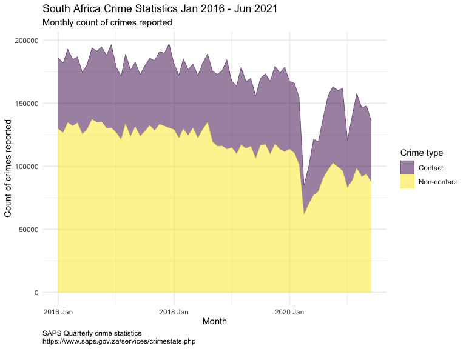
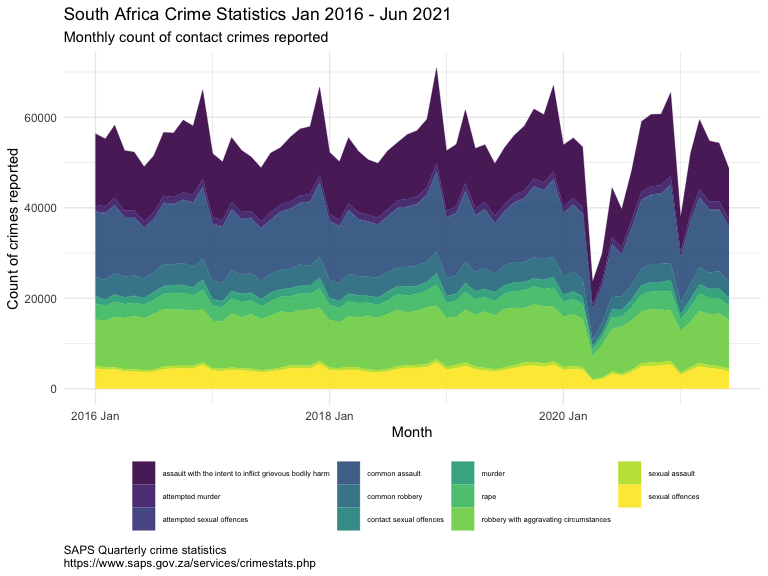
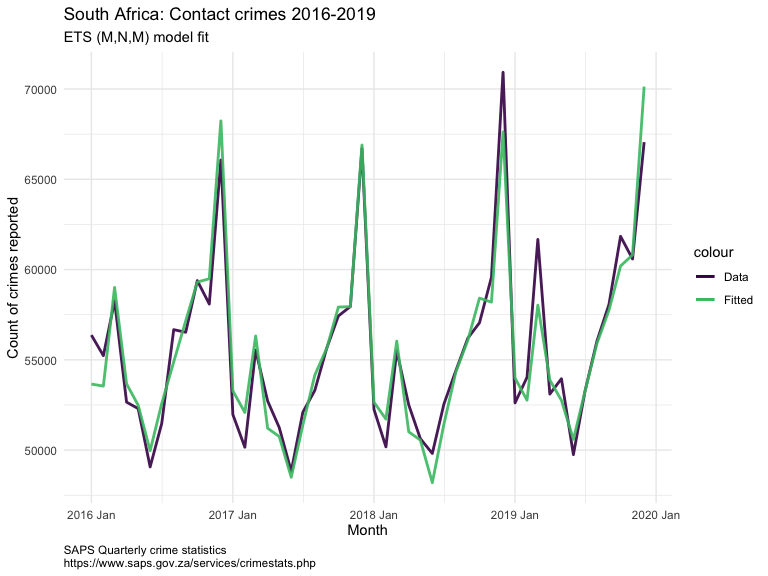
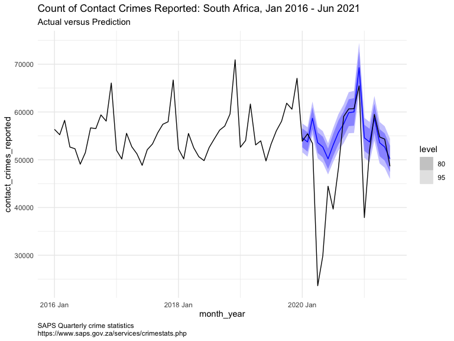
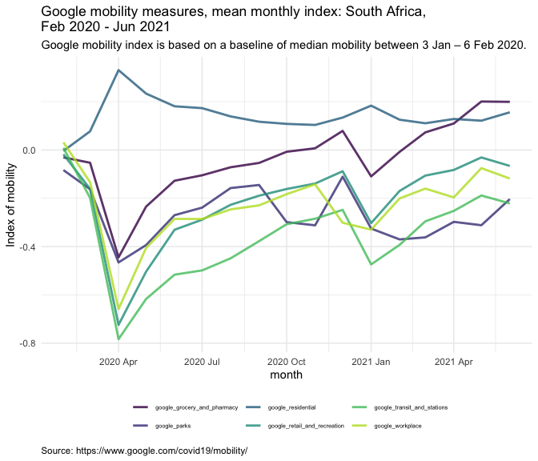
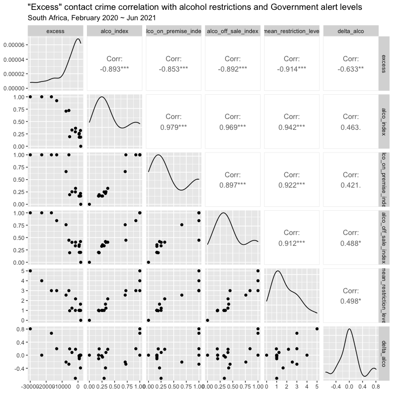
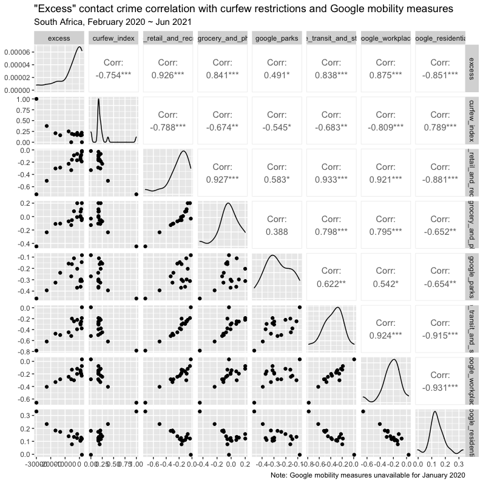
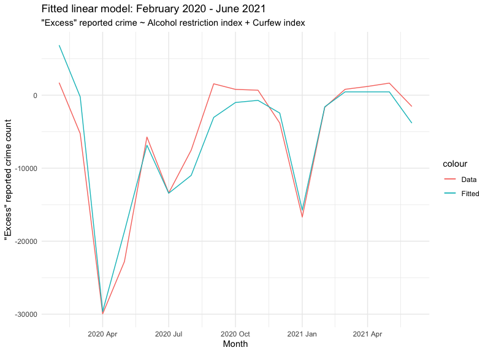
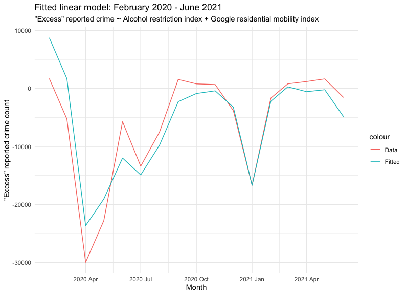

Contact Crime Excess
================
Andrew Fraser
13/09/2021

## Contact Crimes and COVID NPIs

Monthly South African crime statistics are released by SAPS on a
quarterly basis. The latest quarterly statistics includes data for
crimes reported up until end June 2021. This dataset includes complete
monthly crime reporting data from January 2016 and includes data by
crime reports by crime categories, province, district and police
station. When looking at the aggregated reported crimes per month, it is
clear that the COVID pandemic and mitigation interventions has had an
impact on crime patterns.

<!-- -->

## Contact crimes

The reduction of contact crimes during the lockdown of March and April
2020 is significant, and the various categories showed similar
reductions.

<!-- -->

## Estimating the impact of COVID on contact crimes reported.

The count of contact crimes reported by month during the period
2016-2019 shows definite seasonality, and it is therefore possible to
create a model that takes into account that seasonality and fits the
observed data fairly closely.

<!-- -->

### Prediction

From this fitted model a forecast/prediction for the period January 2020
to June 2021 can be built.

<!-- -->

## Calculating “Excess” contact crimes

The differences between the actual crimes reported for 2020 and 2021 and
the mean prediction can be set as an “excess” of reports (i.e., how many
more or fewer crimes were reported than predicted)

## Creating metrics for COVID restrictions and observed impacts.

Various lockdown stages and associated restrictions were applied across
the entire year, and in order to examine their relation to crime
reporting, it is necessary to normalise the time period and to
standardise their severity ((i.e. to apply the different measures that
were applied on portions of months to a mean for the complete month in
order to compare different periods)

## Alcohol restrictions

In order to do this, alcohol restrictions have been divided into two
basic types: a. *Off-sales* restrictions, and, b. *On-premise*
restrictions.

*Off-sales* restrictions relate to sales through retail outlets, and the
severity of the restrictions is measured by the permitted hours of sales
divided by the potential hours of sales should there be no (additional
to normal licensing laws) restrictions. The assumption is made that
off-sales hours in a normally licensed period would be a maximum of 12
hours per day, for six days per week (i.e. Monday to Saturday 08h00 \~
20h00). This is likely erring on the upside, and may understate the
impact of COVID alcohol restrictions on contact crimes reported.

*On-premise* restrictions relate to sales through outlets where the
alcohol is consumed on-site (e.g. bars, restaurants, etc.) The
assumption is made that the normally licensed period would be a maximum
of 16 hours per day, for seven days per week (i.e. Monday to Sunday,
10h00 \~ 02h00). Again, this is likely erring on the upside, as the
majority of outlets would have significantly shorter hours/days of
trade. Again, this may understate the impact of COVID alcohol
restrictions.

In addition, since the crime data are monthly, it is not possible to
measure any impact of the COVID restrictions by day or week. In
particular, it is not possible to measure any kind of “weekend-effect”.

An overall restriction index can be built by combining and weighting the
on-premise and off-sale indices by their estimated proportion of the
market (using 2018 market data by Euromonitor)

## Mobility

The use of lockdowns and curfews to reduce mobility allows the creation
of a *curfew severity index*. This is simply calculated by the
proportion of restricted hours per day, averaged over the month.

An alternate method of measuring mobility is to use Google’s mobility
data. Using data from mobile phones, Google supplies mobility data for
many regions in the world. These are in the form of percentage change
from a baseline in early 2020 (prior to COVID restrictions). These are
supplied on a daily basis, and it is necessary to normalise them by
month. This is done by simply taking the mean for the month and
converting the percentage to a simple index between -1 and 1)

<!-- -->

## Correlation between restrictions and contact crime “excess” reports.

There are strong negative correlations between the alcohol restriction
indices and the “excess” contact crimes reports during this period, and
similarly there are strong (negative and positive) correlations to
various mobility metrics which is to be expected. Since there is likely
cross correlation between alcohol and some of the mobility measures
(specifically the Google retail and recreation metric, as well as the
overall mean restriction level which is based simply on the
Government-mandated alert levels), in order to model the effects of
these restrictions, it is necessary to identify those with the lowest
level of inter-dependence. Within these metrics, it is likely the curfew
level (moderately strong negative correlation with excess contact
crime), the overall alcohol index (strong negative correlation), and the
Google residential metric (strong negative correlation) will satisfy
this requirement. There is a very high correlation with the governmental
“Alert levels” of 0 to 5 but since these included many different
restrictions (including alcohol, tobacco, retail and mobility) and were
often adjusted, they are likely not a good measure.

<!-- --><!-- -->

## Modelling the impact of alcohol restrictions and mobility levels on reported contact crimes.

<!-- -->

    ## 
    ## Call:
    ## lm(formula = excess ~ alco_index + curfew_index, data = contact_crimes_excess1)
    ## 
    ## Residuals:
    ##     Min      1Q  Median      3Q     Max 
    ## -5133.9  -948.2   351.3  1390.4  4605.0 
    ## 
    ## Coefficients:
    ##              Estimate Std. Error t value   Pr(>|t|)    
    ## (Intercept)      6850       1244   5.507 0.00007729 ***
    ## alco_index     -18939       2461  -7.695 0.00000215 ***
    ## curfew_index   -17548       3901  -4.498   0.000501 ***
    ## ---
    ## Signif. codes:  0 '***' 0.001 '**' 0.01 '*' 0.05 '.' 0.1 ' ' 1
    ## 
    ## Residual standard error: 2909 on 14 degrees of freedom
    ## Multiple R-squared:  0.9174, Adjusted R-squared:  0.9056 
    ## F-statistic: 77.77 on 2 and 14 DF,  p-value: 0.00000002617

<!-- -->

    ## 
    ## Call:
    ## lm(formula = excess ~ alco_index + google_residential, data = contact_crimes_excess1)
    ## 
    ## Residuals:
    ##     Min      1Q  Median      3Q     Max 
    ## -7025.7  -589.9  1083.1  1869.5  6263.7 
    ## 
    ## Coefficients:
    ##                    Estimate Std. Error t value Pr(>|t|)   
    ## (Intercept)            8553       2376   3.599  0.00290 **
    ## alco_index           -16579       5346  -3.101  0.00781 **
    ## google_residential   -47244      26149  -1.807  0.09234 . 
    ## ---
    ## Signif. codes:  0 '***' 0.001 '**' 0.01 '*' 0.05 '.' 0.1 ' ' 1
    ## 
    ## Residual standard error: 4097 on 14 degrees of freedom
    ## Multiple R-squared:  0.8363, Adjusted R-squared:  0.8129 
    ## F-statistic: 35.75 on 2 and 14 DF,  p-value: 0.000003154

The model fit with alcohol restriction index and curfew restriction
index is very good and seems to indicate that alcohol restrictions are a
significant cause of reduced contact crime reports. However, there is a
real risk that, given the limited number of data points, the linear
model may be over-fitted.

Even if this model is correct, it is likely that it will not hold when
the July SAPS data is released. In early July there was large scale
unrest that occurred during a period that the sale of alcohol was
banned.

Note: All of the crime data included in this analysis is from SAPS and
is based on crime *reports*. It is possible that during the period of
mobility restrictions that fewer crimes were reported despite actually
occurring.
